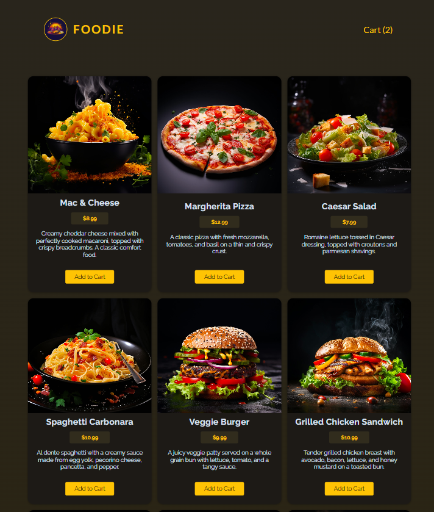
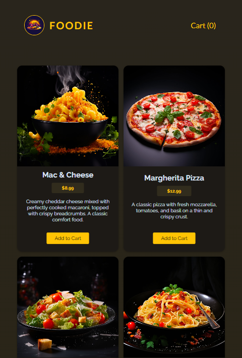
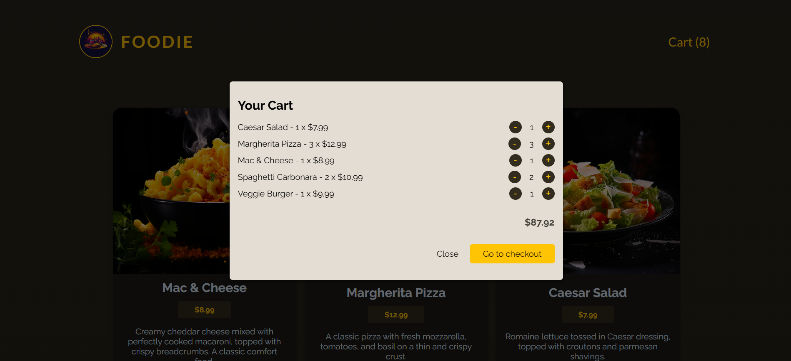
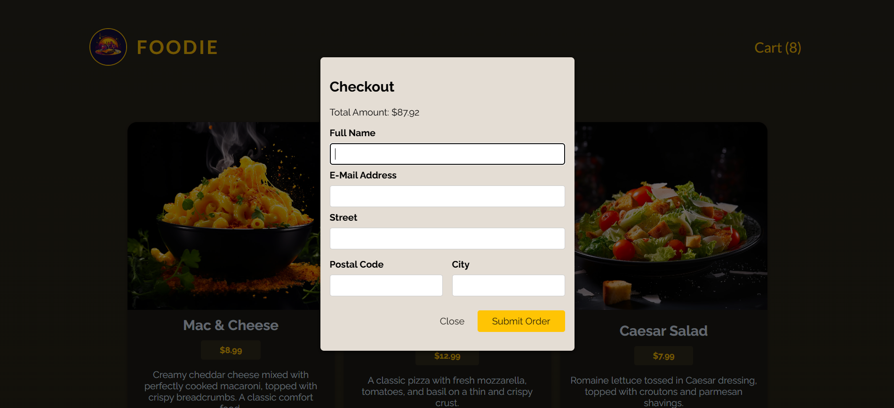
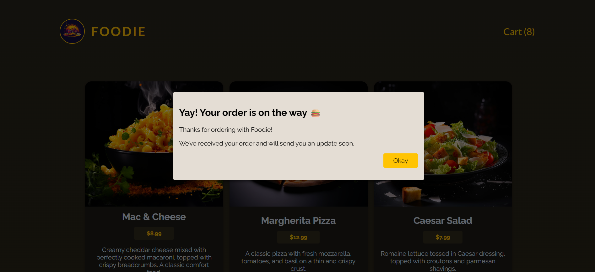
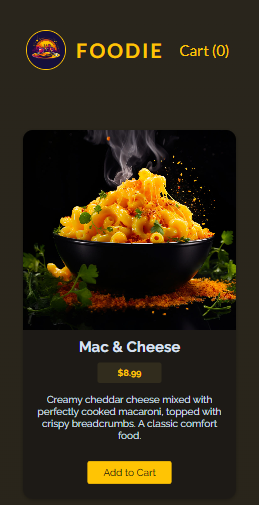
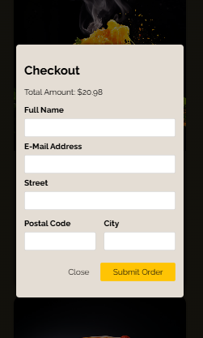

# 🍔 Foodie App


A **full-stack web application** built with **React** (frontend) and Node.js + Express (backend) to **order your favorite meals**.

Browse delicious meals, add/remove items to your cart, click **Cart (N)** in the header to checkout — all in one modern responsive interface.

## 🚀 Features

### Frontend

- **Shopping cart** with add/remove/clear functionality (via global state `CartContext` with `useReducer`)
- **Checkout form** with validation & modal UX (via global state `UserProgressContext` with `useReducer`)
- **`useHttp` custom hook for HTTP requests** with loading & error states and request cancellation
- **Reusable UI components**: Modal (portal), Button, Input, Error, CartItem, MealItem
- **Performance optimizations** with `useMemo` for stable contexts' values
- **Enhanced UX** with loading, error, and success states handling
- **Fully responsive** layout (mobile/tablet/desktop)

<br>

### Backend

- **Prebuilt REST API** for meals & orders, powered by **Node.js + Express**
- **JSON file storage** used for simplicity — easily replaceable with a database
- Provides endpoints for fetching meals and posting orders
- **Integration-ready** architecture, extendable with authentication, database, or cloud deployment

---

## 🛠️ Tech Stack

### 🖥️ Frontend

- **React 19.2.0** (hooks: `useState`, `useReducer`, `useRef`, `useEffect`, `useCallback`, `useMemo`)
- **React Portals** for modal rendering
- **Context API** with **reducer** for cart and user progress contexts
- **FormData object** for handling the checkout form
- **AbortController** for aborting/cancelling HTTP requests
- **JavaScript (ES6+)**
- **CSS3/Styling**
- **Vite** (for development and build)

<br>

### 🏗️ Custom Architecture & Patterns

- **Custom hook**: `useHttp` reusable hook for **handling HTTP requests** (GET, POST, PUT, DELETE methods) with built-in loading state, error handling, and request cancellation.
- **Performance Memoization** by using `useMemo` to memoize the contexts' values

<br>

### 🛠️ Backend

- Node.js
- Express.js for creating REST API endpoints
- JSON files for data storage (available-meals.json & orders.json)

---

## 🚀 Advanced Features

### 📘 `useHttp` custom hook

- **Explanation**: `useHttp` is a production-ready hook that handles HTTP requests (GET, POST, PUT, DELETE methods) with loading state, error handling, request cancellation, and reusable architecture.
- **Used in**: Checkout.jsx (to `POST` orders), Meals.jsx (to `GET` meals)
- **Benefits**: Prevents memory leaks, reduces code duplication, improves maintainability
- **Code**: [frontend/src/hooks/useHttp.js](https://github.com/smadi2512/foodie-app/tree/master/frontend/src/hooks/useHttp.js)
- **Features**:
  - Supports **GET**, **POST**, **PUT**, and **DELETE** methods
  - Handles **`isLoading`, `error`, and `data` states** automatically
  - Uses **`AbortController`** to **cancel ongoing requests** when the component unmounts or before starting a new one
  - Can be **reused across multiple components** by simply passing a `url`, a `config`, and optionally a `initialData`
  - **Automatically triggers requests for `GET` methods on mount**
  - **Non-GET** requests require **manual calling of `sendRequest()`**
  - Prevents race conditions & ensures only the latest request updates states
- **Hook API**:
  ```javascript
  const { data, isLoading, error, sendRequest, clearData } = useHttp(
    url,
    config,
    initialData
  );
  ```

#### Usage examples in components:

```javascript
//GET meals with related states in Meals.jsx
const requestConfig = {}; //Should be outside the component function
const {
  data: loadedMeals,
  isLoading,
  error,
} = useHttp("http://localhost:3000/meals", requestConfig, []);

//-----------------------------------------------------------
//Manual POST Request when the user submits the form's checkout in Checkout.jsx
const requestConfig = {
  method: "POST",
  headers: {
    "Content-Type": "application/json",
  },
}; //Should be outside the component function
const {
  data,
  isLoading: isSending,
  error,
  sendRequest,
  clearData,
} = useHttp("http://localhost:3000/orders", requestConfig);

//somewhere in code
sendRequest(orderData);
```

---

## 📂 Project Structure
Structured in a modular way to keep the code scalable and maintainable.

```text
foodie-app/
├─ backend/
|  ├─ data/
│  │  ├─ available-meals.json
│  │  └─ orders.json
│  ├─ App.jsx                             # Express server with REST API routes
│  └─ package.json
|
|
├─ frontend/
│  ├─ public/
│  ├─ src/
│  │  ├─ assets/
│  │  ├─ components/
│  │  │  ├─ Cart/
│  │  │  │  ├─ Cart.jsx
│  │  │  │  ├─ CartItem.jsx
│  │  │  │  └─ Checkout.jsx
│  │  │  │
│  │  │  ├─ Meals/
│  │  │  │  ├─ MealItem.jsx
│  │  │  │  └─ Meals.jsx
│  │  │  └─ UI/
│  │  │     ├─ Button.jsx
|  |  |     ├─ Error.jsx
│  │  │     ├─ Input.jsx
│  │  │     └─ Modal.jsx
|  |  ├─ Header.jsx
│  │  ├─ hooks/
│  │  │  └─ useHttp.js
│  │  ├─ store/
│  │  │  ├─ CartContext.jsx
│  │  │  └─ UserProgressContext.jsx
│  │  ├─ util/
│  │  │  └─ formatting.js
│  │  ├─ App.jsx                            # Root app component
│  │  └─ main.jsx                           # React entry point
│  └─ package.json
│
│
└─ README.md                                # Project documentation
```

---

## ⚙️ Installation & Usage

### Running Frontend

Clone the repository, install frontend dependencies, and start the frontend server

```bash
git clone git@github.com:smadi2512/foodie-app.git
cd foodie-app
cd frontend
npm install
npm run dev
```

**Note**: The frontend will run on http://localhost:5173

<br>

### Running Backend

In a new terminal, navigate to the backend directory, install its dependencies, and start the backend server:

```bash
cd backend
npm install
npm start
```

**Note**: The backend will run on http://localhost:3000

---

## ✅ How to use the app (user flow)

1. **Browse meals** on the main page.
2. Click **Add to Cart** to add items (Cart updates with quantity and total price).
3. Click **Cart (N) in the header** to open the cart modal.
4. Review items, change quantities(increase/decrease), or go to Checkout.
5. Fill the **checkout form and submit**.
6. On success, the cart clears and the success modal shows.

---

## 📸 Screenshots

<table align="center">
  <tr>
    <td>
      <h4 align="center">Foodie App desktop view</h4>
      
    </td>
    <td>
      <h4 align="center">Foodie App tablet view</h4>
      
    </td>
  </tr>
  <tr>
    <td>
      <h4 align="center">Foodie App's Cart</h4>
      
    </td>
    <td>
      <h4 align="center">Foodie App's Checkout</h4>
      
    </td>
    <td>
      <h4 align="center">Foodie App's Confirmation</h4>
      
    </td>
  </tr>
  <tr>
    <td>
      <h4 align="center">Foodie App mobile view</h4>
      
    </td>
    <td>
      <h4 align="center">Foodie App's Checkout on mobile</h4>
      
    </td>
  </tr>
</table>

---

## 🧩 Future Improvements

- **Authentication** & user accounts
- Orders **dashboard** (order history)
- **Track client's orders**
- **Real database** (MongoDB / PostgreSQL)
- Improved **animations** (Framer Motion) for modals & cart badge
- **Unit & integration tests** (Jest + React Testing Library)

---

## 👩‍💻 Author

Created by **Walaa Smadi**✨ \
Passionate React developer building modern, maintainable, scalable, performant, and user-friendly web apps.

- Email: [walasmadi93@gmail.com](mailto:walasmadi93@gmail.com)
- LinkedIn: [Walaa Smadi](https://www.linkedin.com/in/walaa-bilal-smadi/)
- GitHub: [@smadi2512](https://github.com/smadi2512)

Feel free to fork, star ⭐, and contribute!
